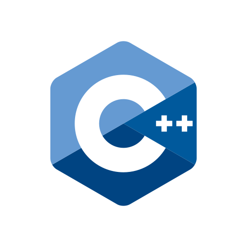
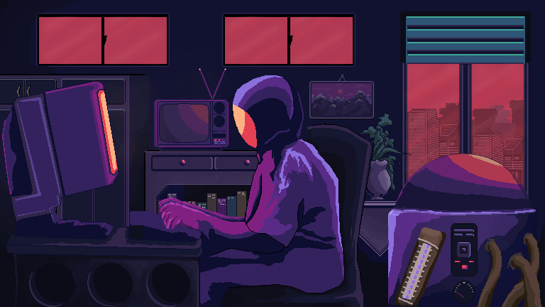

<h1 align="center">
  ¡Hola, soy David Fonseca! 👋
</h1>

  
  
  

  <strong>Desarrollador de software | Apasionado por la resolución de problemas | Amante del código limpio</strong>

  ¡Bienvenido a mi perfil de GitHub! Soy un desarrollador de software con experiencia en JavaScript, C++ y HTML/CSS. Me apasiona la resolución de problemas y disfruto creando soluciones eficientes y elegantes.

  

  
  
  

## 🚀 Habilidades

- Desarrollo de aplicaciones web con HTML, CSS y JavaScript.
- Programación en C++ y resolución de problemas algorítmicos.
- Diseño y desarrollo de bases de datos con MySQL y MongoDB.

## 📫 Contacto

- Sitio web: [#](#)
- Correo electrónico: [david.fonseca12p@gmail.com](mailto:david.fonseca12p@gmail.com)

¡No dudes en contactarme si tienes alguna pregunta, propuesta o simplemente quieres hablar sobre desarrollo de software y tecnología en general!
