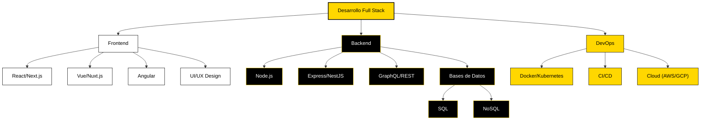

<h1 align="center">
   ¡Hola, soy David Fonseca! 
</h1>

<div align="center">
  
</div>

<div align="center">
  
</div>

<p align="center">
  <strong>Desarrollador Full Stack | Entusiasta de DevOps | Creador de Experiencias Web Innovadoras</strong>
</p>

<p align="center">
  ¡Bienvenido a mi laboratorio digital! Soy un desarrollador apasionado por crear soluciones web robustas y escalables.
</p>

<div align="center">
  
</div>

<div align="center">
  <a href="https://www.linkedin.com/in/david-fonseca-635a3b2a9/"></a>
  <a href="https://dev.to/davidcreat"></a>
  <a href="https://eas1.com.es/"></a>
  <a href="mailto:david.fonseca12p@gmail.com"></a>
</div>

<div align="center">
  
</div>

<br>

<div align="center">
  
</div>

### <div align="center">🚀 Stack Tecnológico</div>

<div align="center">
  
</div>

<details>
  <summary><b>🔍 Ver stack completo</b></summary>
  
  <div align="center">
    <div>
    <h4>Frontend</h4>
    <p>
      
      
      
      
      
    </p>
  </div>
    <div>
    <h4>Backend</h4>
    <p>
      
      
      
      
    </p>
    </div>
    <div>
    <h4>DevOps & Cloud</h4>
    <p>
      
      
      
      
      
    </p>
</div>
</details>

<div align="center">
  
</div>

### 📊 Estadísticas de GitHub

<div align="center">
  <picture>
    <source media="(prefers-color-scheme: dark)" srcset="https://github-readme-stats.vercel.app/api?username=DavidCreat&show_icons=true&theme=dark&bg_color=000000&title_color=FFD700&text_color=FFFFFF&icon_color=FFD700&hide_border=true&include_all_commits=true&count_private=true&rank_icon=github">
    <source media="(prefers-color-scheme: light)" srcset="https://github-readme-stats.vercel.app/api?username=DavidCreat&show_icons=true&theme=default&bg_color=FFFFFF&title_color=000000&text_color=000000&icon_color=FFD700&hide_border=true&include_all_commits=true&count_private=true&rank_icon=github">
    
  </picture>
</div>

<div align="center">
  <picture>
    <source media="(prefers-color-scheme: dark)" srcset="https://github-readme-streak-stats.herokuapp.com/?user=DavidCreat&background=000000&stroke=FFD700&ring=FFD700&fire=FFFFFF&currStreakNum=FFFFFF&sideNums=FFFFFF&currStreakLabel=FFD700&sideLabels=FFD700&dates=FFFFFF&hide_border=true">
    <source media="(prefers-color-scheme: light)" srcset="https://github-readme-streak-stats.herokuapp.com/?user=DavidCreat&background=FFFFFF&stroke=000000&ring=FFD700&fire=FFD700&currStreakNum=000000&sideNums=000000&currStreakLabel=000000&sideLabels=000000&dates=000000&hide_border=true">
    
  </picture>
</div>

<div align="center">
  
</div>

### 🏆 Trofeos de GitHub

<p align="center">
  
</p>

<div align="center">
  
</div>

### 🌟 Proyectos Destacados

<div align="center">
  <a href="https://github.com/DavidCreat/Sistema-de-Gestion-Orgnizada">
    
  </a>
  
  <a href="https://github.com/DavidCreat/fesc-student-agenda">
    
  </a>
</div>

<div align="center">
  
</div>

### 📈 Contribuciones

<p align="center">
  
</p>

<div align="center">
  
</div>

### 🎵 Actualmente escuchando

<div align="center">
  <a href="https://spotify-github-profile.kittinanx.com/api/view.svg?uid=ytp4zazw91jvaybdwrk3bshd9&redirect=true">
    
  </a>
</div>

<div align="center">
  
</div>

### 💻 Lenguajes Más Usados

<div align="center">
  <picture>
    <source media="(prefers-color-scheme: dark)" srcset="https://github-readme-stats.vercel.app/api/top-langs/?username=DavidCreat&layout=donut-vertical&theme=dark&bg_color=000000&title_color=FFD700&text_color=FFFFFF&icon_color=FFD700&hide_border=true&langs_count=8">
    <source media="(prefers-color-scheme: light)" srcset="https://github-readme-stats.vercel.app/api/top-langs/?username=DavidCreat&layout=donut-vertical&theme=default&bg_color=FFFFFF&title_color=000000&text_color=000000&icon_color=FFD700&hide_border=true&langs_count=8">
    
  </picture>
</div>

<div align="center">
  
</div>

### 🌐 Redes Sociales

<div align="center">
  <a href="https://www.linkedin.com/in/david-fonseca-635a3b2a9/">
    
  </a>
  <a href="https://dev.to/davidcreat">
    
  </a>
  <a href="https://eas1.com.es/">
    
  </a>
</div>

<div align="center">
  
</div>

### 📚 Últimos Artículos en Dev.to

<!-- BLOG-POST-LIST:START -->
<!-- BLOG-POST-LIST:END -->

<div align="center">
  <a href="https://dev.to/davidcreat">
    
  </a>
</div>

<div align="center">
  
</div>

### 🤝 Contribuciones Open Source

<p align="center">
  
</p>

<div align="center">
  
</div>

### 📫 Contacto

<div align="center">
  <a href="https://eas1.com.es">
    
  </a>
  <a href="mailto:david.fonseca12p@gmail.com">
    
  </a>
</div>

<div align="center">
  
</div>

<div align="center">
  
</div>

<details>
  <summary>📊 Estadísticas Detalladas</summary>
  <div align="center">
    <h3>Wakatime Stats</h3>
    
    
    <h3>Contribuciones por Hora del Día</h3>
    
    
    <h3>Resumen de Perfil</h3>
    
  </div>
</details>

<div align="center">
  
</div>

### 🎨 Mis Habilidades



<div align="center">
  
</div>

### 🏋️ Reto de Código Diario (Actualizado: 21 de Marzo, 2025)

<details open>
<summary><b>Reto del día: Implementación de un Algoritmo de Búsqueda Binaria en TypeScript con Visualización</b></summary>

```typescript
/**
 * 🌟 Reto del día: Implementación de un algoritmo de búsqueda binaria optimizado
 * con análisis de complejidad temporal y espacial y visualización del proceso.
 * 
 * Fecha: 21 de Marzo, 2025
 * Autor: David Fonseca
 */

// Función principal de búsqueda binaria
function binarySearch<T>(arr: T[], target: T): { index: number; steps: Array<{ left: number; right: number; mid: number; found: boolean }> } {
  let left = 0;
  let right = arr.length - 1;
  const steps: Array<{ left: number; right: number; mid: number; found: boolean }> = [];
  
  while (left <= right) {
    // Evitamos overflow usando esta fórmula en lugar de (left + right) / 2
    const mid = left + Math.floor((right - left) / 2);
    
    // Registramos este paso para visualización
    const found = arr[mid] === target;
    steps.push({ left, right, mid, found });
    
    if (found) {
      return { index: mid, steps }; // Elemento encontrado
    }
    
    if (arr[mid] < target) {
      left = mid + 1; // Buscar en la mitad derecha
    } else {
      right = mid - 1; // Buscar en la mitad izquierda
    }
  }
  
  return { index: -1, steps }; // Elemento no encontrado
}

// Función para visualizar los pasos de la búsqueda
function visualizeSearch(arr: number[], result: { index: number; steps: Array<{ left: number; right: number; mid: number; found: boolean }> }): void {
  console.log("🔍 Visualización de la búsqueda binaria:");
  console.log("Array:", arr.join(" | "));
  
  result.steps.forEach((step, i) => {
    const visualization = arr.map((val, idx) => {
      if (idx === step.mid) return `[${val}]`;
      if (idx >= step.left && idx <= step.right) return `${val}`;
      return ` ${val} `;
    }).join(" | ");
    
    console.log(`\nPaso ${i + 1}:`);
    console.log(`Rango de búsqueda: [${step.left} - ${step.right}]`);
    console.log(`Elemento medio en índice ${step.mid}: ${arr[step.mid]}`);
    console.log(visualization);
    
    if (step.found) {
      console.log("✅ ¡Elemento encontrado!");
    }
  });
  
  if (result.index === -1) {
    console.log("\n❌ Elemento no encontrado en el array.");
  } else {
    console.log(`\n✅ Elemento encontrado en el índice ${result.index}.`);
  }
}

// Ejemplo de uso
const sortedArray = [1, 3, 5, 7, 9, 11, 13, 15, 17, 19];
const target = 13;
const searchResult = binarySearch(sortedArray, target);

console.log(`Buscando ${target} en el array:`);
console.log(sortedArray);
visualizeSearch(sortedArray, searchResult);

/**
 * Análisis de complejidad:
 * - Tiempo: O(log n) - Dividimos el espacio de búsqueda a la mitad en cada iteración
 * - Espacio: O(log n) - Almacenamos los pasos para visualización
 * 
 * Ventajas de la búsqueda binaria:
 * - Muy eficiente para grandes conjuntos de datos ordenados
 * - Garantiza encontrar el elemento en log(n) pasos como máximo
 */
```

</details>

<div align="center">
  <h3>💫 Gracias por visitar mi perfil</h3>
  <p>¿Tienes algún proyecto interesante? ¡Hablemos!</p>
  
</div>
