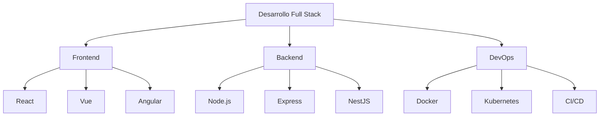

<h1 align="center">
  ¡Hola, soy David Fonseca! 👋
</h1>

<p align="center">
  <strong>Desarrollador Full Stack | Entusiasta de DevOps | Creador de Experiencias Web Innovadoras</strong>
</p>

<p align="center">
  ¡Bienvenido a mi laboratorio digital! Soy un desarrollador apasionado por crear soluciones web robustas y escalables.
</p>


<p align="center">
  
</p>

---

### 🚀 Stack Tecnológico

<p align="center">
  
</p>

---

### 📊 Estadísticas de GitHub

<p align="center">
  
</p>

<p align="center">
  
</p>

---

### 🏆 Trofeos de GitHub

<p align="center">
  
</p>

---

### 🌟 Proyectos Destacados

<p align="center">
  <a href="https://github.com/DavidCreat/Sistema-de-Gestion-Orgnizada">
    
  </a>
</p>

---

### 📈 Contribuciones

<p align="center">
  
</p>

---

### 🎵 Actualmente escuchando

[](https://spotify-github-profile.kittinanx.com/api/view.svg?uid=ytp4zazw91jvaybdwrk3bshd9&redirect=true)


---

### 💻 Lenguajes Más Usados

<p align="center">
  
</p>

---

### 🌐 Redes Sociales

[](https://www.linkedin.com/in/david-fonseca-635a3b2a9/)  
[](https://dev.to/davidcreat)  
[](https://eas1.com.es/)


---

### 📚 Últimos Artículos en Dev.to

<!-- BLOG-POST-LIST:START -->
<!-- BLOG-POST-LIST:END -->

---

### 🤝 Contribuciones Open Source

<p align="center">
  
</p>

---

### 📫 Contacto

- Sitio web: [eas1.com.es](https://eas1.com.es)
- Correo: [david.fonseca12p@gmail.com](mailto:david.fonseca12p@gmail.com)

<p align="center">
  
</p>

---

<details>
  <summary>📊 Estadísticas Detalladas</summary>
  
  ### Wakatime Stats
  
  
  
  ### Contribuciones por Hora del Día
  
  
</details>


---

### 🎨 Mis Habilidades


### 🏋️ Reto de Código Diario

<details>
<summary>Ver el reto de hoy</summary>

```
js project="Reto Diario" file="reto-del-dia.js" type="nodejs"
function fibonacci(n) {
  if (n <= 1) return n;
  return fibonacci(n - 1) + fibonacci(n - 2);
}

console.log("Los primeros 10 números de Fibonacci son:");
for (let i = 0; i < 10; i++) {
  console.log(fibonacci(i));
}
```
