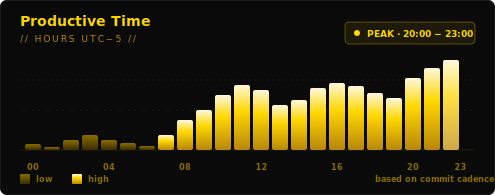
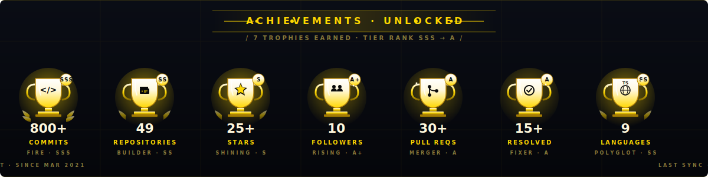
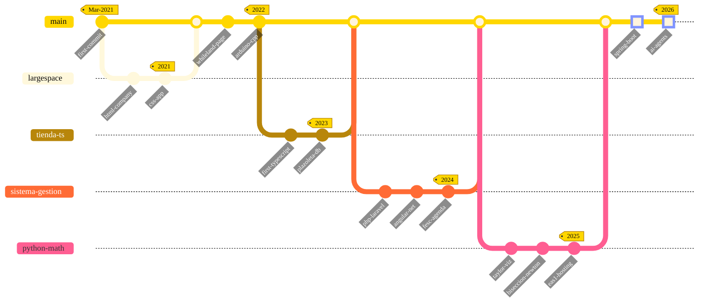

<!--
  ╔══════════════════════════════════════════════════════════════════╗
  ║  DAVID FONSECA  //  GITHUB PROFILE  //  v2026.04                 ║
  ║                                                                  ║
  ║  Construido con:                                                 ║
  ║   - SVG animado con <foreignObject> + CSS keyframes              ║
  ║   - SMIL nativo (animate, animateTransform)                      ║
  ║   - GitHub Flavored Markdown + Alerts + Mermaid                  ║
  ║   - LaTeX / KaTeX para ecuaciones                                ║
  ║   - GitHub Actions para contenido dinamico                       ║
  ║                                                                  ║
  ║  "Lo que ves no es una imagen. Es codigo que se dibuja a si      ║
  ║   mismo cada vez que abres esta pagina."                         ║
  ╚══════════════════════════════════════════════════════════════════╝
-->

<div align="center">
  <a href="https://eas1.com.es">
    
  </a>
</div>

<p align="center">
  <a href="https://www.linkedin.com/in/david-fonseca-635a3b2a9/"></a>
  <a href="https://dev.to/davidcreat"></a>
  <a href="https://eas1.com.es/"></a>
  <a href="mailto:david.fonseca12p@gmail.com"></a>
  
  
</p>

<br/>

<!-- ════════════════════════════════════════════════════════════════ -->
<!--  01  ·  WHOAMI                                                    -->
<!-- ════════════════════════════════════════════════════════════════ -->

<div align="center">
  
</div>

<div align="center">
  
</div>

<div align="center">
  
</div>

<p align="center">
  <a href="https://eas1.com.es"></a>
  <a href="https://dev.to/davidcreat"></a>
  <a href="mailto:david.fonseca12p@gmail.com"></a>
</p>

<br/>

<!-- ════════════════════════════════════════════════════════════════ -->
<!--  02  ·  TECH CONSTELLATION                                        -->
<!-- ════════════════════════════════════════════════════════════════ -->

<div align="center">
  
</div>

<div align="center">
  
</div>

<table align="center" width="100%">
  <tr>
    <td align="center" width="18%" valign="middle">
      
    </td>
    <td width="32%" valign="middle">
      <b>Frontend Stack</b>
      <br/>
      <sub><samp>user-facing · SPA · SSR · design-systems</samp></sub>
    </td>
    <td width="50%" align="center" valign="middle">
      
    </td>
  </tr>
  <tr><td colspan="3"><sub>&nbsp;</sub></td></tr>
  <tr>
    <td align="center" valign="middle">
      
    </td>
    <td valign="middle">
      <b>Backend &amp; APIs</b>
      <br/>
      <sub><samp>services · typed contracts · real-time</samp></sub>
    </td>
    <td align="center" valign="middle">
      
    </td>
  </tr>
  <tr><td colspan="3"><sub>&nbsp;</sub></td></tr>
  <tr>
    <td align="center" valign="middle">
      
    </td>
    <td valign="middle">
      <b>Data Engines</b>
      <br/>
      <sub><samp>SQL · NoSQL · cache · ORM</samp></sub>
    </td>
    <td align="center" valign="middle">
      
    </td>
  </tr>
  <tr><td colspan="3"><sub>&nbsp;</sub></td></tr>
  <tr>
    <td align="center" valign="middle">
      
    </td>
    <td valign="middle">
      <b>Cloud &amp; DevOps</b>
      <br/>
      <sub><samp>IaC · containers · CI/CD · observability</samp></sub>
    </td>
    <td align="center" valign="middle">
      
    </td>
  </tr>
  <tr><td colspan="3"><sub>&nbsp;</sub></td></tr>
  <tr>
    <td align="center" valign="middle">
      
    </td>
    <td valign="middle">
      <b>Tooling &amp; AI</b>
      <br/>
      <sub><samp>dev-loop · testing · design · ML</samp></sub>
    </td>
    <td align="center" valign="middle">
      
    </td>
  </tr>
</table>

<br/>

<!-- ════════════════════════════════════════════════════════════════ -->
<!--  03  ·  METRICS                                                   -->
<!-- ════════════════════════════════════════════════════════════════ -->

<div align="center">
  
</div>

<div align="center">
  <picture>
    <source media="(prefers-color-scheme: dark)" srcset="https://github-readme-stats.vercel.app/api?username=DavidCreat&show_icons=true&theme=transparent&title_color=FFD700&text_color=E6E1CF&icon_color=FFD700&hide_border=true&include_all_commits=true&count_private=true&rank_icon=percentile&card_width=450"/>
    <source media="(prefers-color-scheme: light)" srcset="https://github-readme-stats.vercel.app/api?username=DavidCreat&show_icons=true&theme=transparent&title_color=8A6D00&text_color=1a1a1a&icon_color=B8860B&hide_border=true&include_all_commits=true&count_private=true&rank_icon=percentile&card_width=450"/>
    
  </picture>
  <picture>
    <source media="(prefers-color-scheme: dark)" srcset="https://streak-stats.demolab.com?user=DavidCreat&theme=transparent&hide_border=true&stroke=FFD700&ring=FFD700&fire=FFF8DC&currStreakNum=E6E1CF&sideNums=E6E1CF&currStreakLabel=FFD700&sideLabels=FFD700&dates=E6E1CF&background=00000000"/>
    <source media="(prefers-color-scheme: light)" srcset="https://streak-stats.demolab.com?user=DavidCreat&theme=transparent&hide_border=true&stroke=B8860B&ring=B8860B&fire=FFD700&currStreakNum=1a1a1a&sideNums=1a1a1a&currStreakLabel=8A6D00&sideLabels=8A6D00&dates=1a1a1a&background=FFFFFF00"/>
    
  </picture>
</div>

<div align="center">
  <picture>
    <source media="(prefers-color-scheme: dark)" srcset="https://github-readme-stats.vercel.app/api/top-langs/?username=DavidCreat&layout=compact&theme=transparent&title_color=FFD700&text_color=E6E1CF&hide_border=true&langs_count=10&card_width=450"/>
    <source media="(prefers-color-scheme: light)" srcset="https://github-readme-stats.vercel.app/api/top-langs/?username=DavidCreat&layout=compact&theme=transparent&title_color=8A6D00&text_color=1a1a1a&hide_border=true&langs_count=10&card_width=450"/>
    
  </picture>
  
</div>

<br/>

<!-- ════════════════════════════════════════════════════════════════ -->
<!--  04  ·  ACTIVITY GRAPH                                            -->
<!-- ════════════════════════════════════════════════════════════════ -->

<div align="center">
  
</div>

<picture>
  <source media="(prefers-color-scheme: dark)" srcset="https://github-readme-activity-graph.vercel.app/graph?username=DavidCreat&theme=react-dark&bg_color=00000000&color=FFD700&line=FFD700&point=FFF8DC&area=true&area_color=FFD700&hide_border=true&radius=12&custom_title=Contribution%20Timeline"/>
  <source media="(prefers-color-scheme: light)" srcset="https://github-readme-activity-graph.vercel.app/graph?username=DavidCreat&theme=minimal&bg_color=FFFFFF00&color=8A6D00&line=B8860B&point=8A6D00&area=true&area_color=FFD700&hide_border=true&radius=12&custom_title=Contribution%20Timeline"/>
  
</picture>

<br/>

<!-- ════════════════════════════════════════════════════════════════ -->
<!--  05  ·  SNAKE (auto-generated)                                    -->
<!-- ════════════════════════════════════════════════════════════════ -->

<div align="center">
  
</div>

<picture>
  <source media="(prefers-color-scheme: dark)" srcset="https://raw.githubusercontent.com/DavidCreat/DavidCreat/output/snake-dark.svg"/>
  <source media="(prefers-color-scheme: light)" srcset="https://raw.githubusercontent.com/DavidCreat/DavidCreat/output/snake.svg"/>
  
</picture>

<br/>

<!-- ════════════════════════════════════════════════════════════════ -->
<!--  06  ·  TROPHIES + PROFILE CARDS                                  -->
<!-- ════════════════════════════════════════════════════════════════ -->

<div align="center">
  
</div>

<div align="center">
  
</div>

<div align="center">
  
</div>

<br/>

<!-- ════════════════════════════════════════════════════════════════ -->
<!--  07  ·  PINNED                                                    -->
<!-- ════════════════════════════════════════════════════════════════ -->

<div align="center">
  
</div>

<div align="center">
  <a href="https://github.com/DavidCreat/Sistema-de-Gestion-Orgnizada">
    
  </a>
  <a href="https://github.com/DavidCreat/fesc-student-agenda">
    
  </a>
</div>

<div align="center">
  <a href="https://github.com/DavidCreat/Archivo_Central">
    
  </a>
  <a href="https://github.com/DavidCreat/Angular-.Net">
    
  </a>
</div>

<div align="center">
  <a href="https://github.com/DavidCreat/TaylorViz">
    
  </a>
  <a href="https://github.com/DavidCreat/hackaton">
    
  </a>
</div>

<br/>

<!-- ════════════════════════════════════════════════════════════════ -->
<!--  08  ·  CAREER TIMELINE (Mermaid)                                 -->
<!-- ════════════════════════════════════════════════════════════════ -->

<div align="center">
  
</div>


```mermaid
%%{ init: { 'theme':'base', 'themeVariables': { 'fontFamily':'ui-monospace, SF Mono, Consolas, monospace', 'fontSize':'13px', 'primaryColor':'#0a0a0a', 'primaryTextColor':'#FFFFFF', 'primaryBorderColor':'#FFD700', 'lineColor':'#FFD700', 'clusterBkg':'transparent', 'clusterBorder':'#FFD700', 'edgeLabelBackground':'#0a0a0a' } } }%%
flowchart LR
    classDef year       fill:#FFD700,color:#0a0a0a,stroke:#B8860B,stroke-width:2px,font-weight:bold
    classDef origin     fill:#fff8dc,color:#0a0a0a,stroke:#B8860B,stroke-width:2.5px,font-weight:bold
    classDef milestone  fill:#0a0a0a,color:#FFFFFF,stroke:#FFD700,stroke-width:1.5px
    classDef highlight  fill:#1a1a1a,color:#FFD700,stroke:#FFD700,stroke-width:2px,font-weight:bold

    START(["⟡ Mar 2021<br/>ORIGIN"]):::origin --> Y1
    Y1["2021"]:::year --> M1["LargeSpace-Company<br/>HTML · primer repo"]:::milestone
    M1 --> M2["Large-Space-App<br/>CSS · primer deploy"]:::milestone
    M2 --> Y2

    Y2["2022"]:::year --> M3["whileland_page<br/>HTML landings"]:::milestone
    M3 --> M4["Arduino + C++<br/>temperature IoT"]:::milestone
    M4 --> Y3

    Y3["2023"]:::year --> M5["tienda<br/>primer TypeScript"]:::milestone
    M5 --> M6["Plazoleta Comidas<br/>DB · backend SQL"]:::milestone
    M6 --> Y4

    Y4["2024"]:::year --> M7["Sistema Gestion<br/>PHP · Laravel"]:::milestone
    M7 --> M8["Angular + .NET<br/>enterprise stack"]:::milestone
    M8 --> M9["FESC Agenda<br/>TS · React"]:::milestone
    M9 --> Y5

    Y5["2025"]:::year --> M10["TaylorViz · Python<br/>metodos numericos"]:::milestone
    M10 --> M11["EAS1 HOSTING<br/>DevOps · infra"]:::milestone
    M11 --> Y6

    Y6["2026"]:::year --> M12["Spring Boot<br/>Java enterprise"]:::highlight
    M12 --> M13["AI Agents<br/>Full Stack Architect"]:::highlight
```

<br/>

<!-- ════════════════════════════════════════════════════════════════ -->
<!--  09  ·  RELEASE GRAPH (Mermaid gitGraph)                          -->
<!-- ════════════════════════════════════════════════════════════════ -->

<div align="center">
  
</div>


```mermaid
%%{ init: { 'theme':'base', 'themeVariables': { 'fontFamily':'ui-monospace, SF Mono, Consolas, monospace', 'fontSize':'13px', 'git0':'#FFD700', 'git1':'#FFF8DC', 'git2':'#B8860B', 'git3':'#FF6B35', 'gitBranchLabel0':'#0a0a0a', 'gitBranchLabel1':'#0a0a0a', 'gitBranchLabel2':'#FFFFFF', 'gitBranchLabel3':'#FFFFFF', 'commitLabelColor':'#FFFFFF', 'commitLabelBackground':'#1a1a1a', 'commitLabelBorder':'#FFD700', 'tagLabelColor':'#0a0a0a', 'tagLabelBackground':'#FFD700', 'tagLabelBorder':'#B8860B', 'titleColor':'#FFFFFF' } } }%%
gitGraph
    commit id: "first-commit" tag: "Mar-2021"
    branch largespace
    commit id: "html-company"
    commit id: "css-app" tag: "2021"
    checkout main
    merge largespace
    commit id: "whileland-page"
    commit id: "arduino-cpp" tag: "2022"
    branch tienda-ts
    commit id: "first-typescript"
    commit id: "plazoleta-db" tag: "2023"
    checkout main
    merge tienda-ts
    branch sistema-gestion
    commit id: "php-laravel"
    commit id: "angular-net"
    commit id: "fesc-agenda" tag: "2024"
    checkout main
    merge sistema-gestion
    branch python-math
    commit id: "taylor-viz"
    commit id: "biseccion-newton"
    commit id: "eas1-hosting" tag: "2025"
    checkout main
    merge python-math
    commit id: "spring-boot" type: HIGHLIGHT
    commit id: "ai-agents" type: HIGHLIGHT tag: "2026"
```

<br/>

<!-- ════════════════════════════════════════════════════════════════ -->
<!--  10  ·  ALGORITHM OF THE MONTH                                    -->
<!-- ════════════════════════════════════════════════════════════════ -->

<div align="center">
  
</div>

<p>
  <samp><b>&gt;</b> <code>busqueda binaria adaptativa</code> &nbsp;·&nbsp; analisis formal de complejidad</samp>
</p>

La complejidad de una busqueda binaria sobre un arreglo ordenado de tamaño $n$ satisface la recurrencia:

$$T(n) \;=\; T\!\left(\frac{n}{2}\right) + \mathcal{O}(1) \;\;\Longrightarrow\;\; T(n) \in \mathcal{O}(\log_2 n)$$

Y el numero exacto de iteraciones en el peor caso es:

$$\text{iter}_{\max}(n) \;=\; \left\lfloor \log_2 n \right\rfloor + 1$$

<details>
<summary><samp><b>&gt;</b> Ver implementacion en TypeScript con visualizacion</samp></summary>

```typescript
/**
 * Busqueda binaria instrumentada: devuelve el indice y cada paso
 * del proceso para poder visualizar como el espacio se reduce a la mitad.
 *
 * Tiempo:  O(log n) — halving
 * Espacio: O(log n) — historial de pasos (O(1) sin historial)
 */
type Step = { left: number; right: number; mid: number; hit: boolean };

function binarySearch<T>(arr: readonly T[], target: T): { index: number; steps: Step[] } {
  const steps: Step[] = [];
  let left = 0;
  let right = arr.length - 1;

  while (left <= right) {
    const mid = left + ((right - left) >> 1); // safe from overflow
    const hit = arr[mid] === target;
    steps.push({ left, right, mid, hit });

    if (hit)               return { index: mid, steps };
    if (arr[mid] < target) left  = mid + 1;
    else                   right = mid - 1;
  }
  return { index: -1, steps };
}

// Visualizacion ASCII: muestra el rango activo en cada iteracion
function visualize(arr: readonly number[], { steps, index }: ReturnType<typeof binarySearch<number>>) {
  for (const [i, s] of steps.entries()) {
    const row = arr
      .map((v, idx) =>
        idx === s.mid                 ? `[${v}]` :
        idx >= s.left && idx <= s.right ?  `${v}`  :
                                           ` ${v}`)
      .join(" | ");
    console.log(`step ${i + 1}: ${row}`);
  }
  console.log(index === -1 ? "not found" : `found at index ${index}`);
}

visualize([1, 3, 5, 7, 9, 11, 13, 15, 17, 19],
          binarySearch([1, 3, 5, 7, 9, 11, 13, 15, 17, 19], 13));
```

</details>

<br/>

<!-- ════════════════════════════════════════════════════════════════ -->
<!--  11  ·  LATEST FROM DEV.TO (auto-synced)                          -->
<!-- ════════════════════════════════════════════════════════════════ -->

<div align="center">
  
</div>

<!-- BLOG-POST-LIST:START -->
<!-- BLOG-POST-LIST:END -->

<p align="center">
  <a href="https://dev.to/davidcreat"></a>
</p>

<br/>

<!-- ════════════════════════════════════════════════════════════════ -->
<!--  12  ·  NOW PLAYING                                               -->
<!-- ════════════════════════════════════════════════════════════════ -->

<div align="center">
  
</div>

<div align="center">
  <a href="https://spotify-github-profile.kittinanx.com/api/view.svg?uid=ytp4zazw91jvaybdwrk3bshd9&redirect=true">
    
  </a>
</div>

<br/>

<!-- ════════════════════════════════════════════════════════════════ -->
<!--  13  ·  HIRE ME                                                   -->
<!-- ════════════════════════════════════════════════════════════════ -->

<div align="center">
  
</div>

<p align="center">
  <samp>
    Arquitectura cloud &nbsp;·&nbsp; migracion a TypeScript end-to-end &nbsp;·&nbsp; MVPs de AI en produccion.
    <br/>
    <b>Hablemos.</b>
  </samp>
</p>

<p align="center">
  <a href="mailto:david.fonseca12p@gmail.com"></a>
  <a href="https://eas1.com.es"></a>
  <a href="https://www.linkedin.com/in/david-fonseca-635a3b2a9/"></a>
</p>

<br/>

<!-- ════════════════════════════════════════════════════════════════ -->
<!--  FOOTER                                                           -->
<!-- ════════════════════════════════════════════════════════════════ -->

<div align="center">
  
</div>
