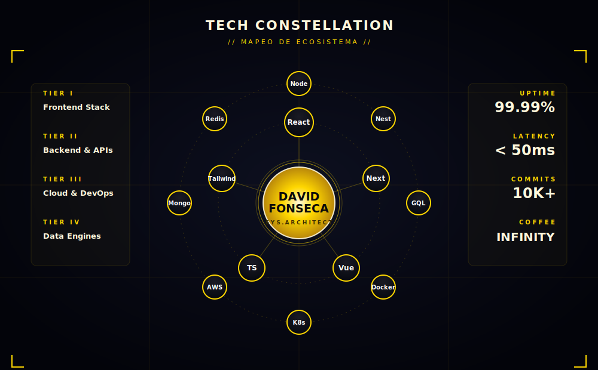
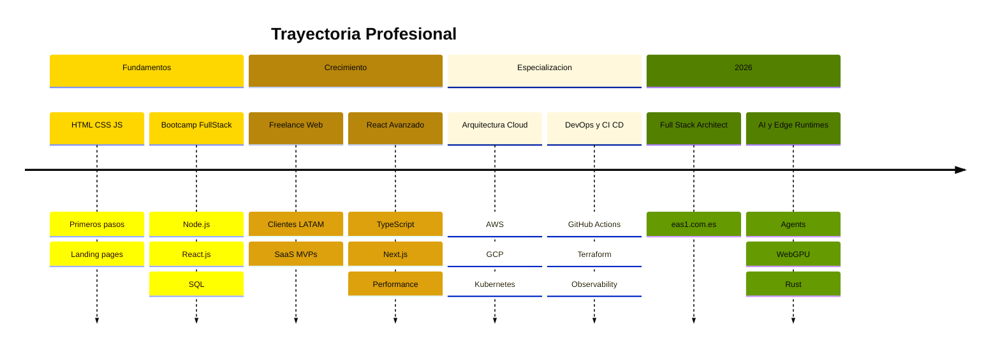
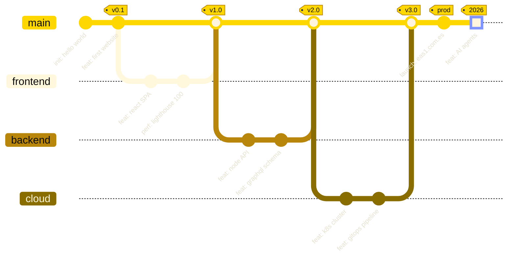

<!--
  ╔══════════════════════════════════════════════════════════════════╗
  ║  DAVID FONSECA  //  GITHUB PROFILE  //  v2026.04                 ║
  ║                                                                  ║
  ║  Construido con:                                                 ║
  ║   - SVG animado con <foreignObject> + CSS keyframes              ║
  ║   - SMIL nativo (animate, animateTransform)                      ║
  ║   - GitHub Flavored Markdown + Alerts + Mermaid                  ║
  ║   - LaTeX / KaTeX para ecuaciones                                ║
  ║   - GitHub Actions para contenido dinamico                       ║
  ║                                                                  ║
  ║  "Lo que ves no es una imagen. Es codigo que se dibuja a si      ║
  ║   mismo cada vez que abres esta pagina."                         ║
  ╚══════════════════════════════════════════════════════════════════╝
-->

<div align="center">
  <a href="https://eas1.com.es">
    
  </a>
</div>

<p align="center">
  <a href="https://www.linkedin.com/in/david-fonseca-635a3b2a9/"></a>
  <a href="https://dev.to/davidcreat"></a>
  <a href="https://eas1.com.es/"></a>
  <a href="mailto:david.fonseca12p@gmail.com"></a>
  
  
</p>

<br/>

> [!IMPORTANT]
> **Este README se construye a si mismo.** Mientras lees, tres workflows de GitHub Actions estan corriendo en background: uno regenera la animacion de la serpiente comiendose mis contribuciones, otro reconstruye el grafo 3D de actividad, y otro sincroniza mis ultimos articulos de Dev.to. Lo que ves siempre esta vivo.

> [!TIP]
> Si quieres saber **como esta hecho** cada efecto, abre el `README.md` en modo raw. No hay trucos: es SVG + CSS + SMIL + Actions, todo compatible con el renderer oficial de GitHub.

<br/>

<!-- ════════════════════════════════════════════════════════════════ -->
<!--  01  ·  WHOAMI                                                    -->
<!-- ════════════════════════════════════════════════════════════════ -->

<h2>
  <samp>&gt; 01 · whoami</samp>
</h2>

<div align="center">
  
</div>

<table align="center">
  <tr>
    <td valign="top" width="33%">
      <h3 align="center"><samp>· SNAPSHOT ·</samp></h3>
      <p align="left">
        <samp>
        Arquitecto Full Stack con obsesion por <b>DX</b>, sistemas distribuidos y experiencias web que se sienten instantaneas.
        Diseño APIs tipadas end-to-end, pipelines CI/CD idempotentes y UIs que respetan al usuario.
        </samp>
      </p>
    </td>
    <td valign="top" width="33%">
      <h3 align="center"><samp>· CURRENTLY ·</samp></h3>
      <ul>
        <li><samp>Shipping en <b>eas1.com.es</b></samp></li>
        <li><samp>Explorando <b>edge runtimes</b> &amp; <b>AI agents</b></samp></li>
        <li><samp>Aprendiendo <b>Rust</b> &amp; <b>WebGPU</b></samp></li>
        <li><samp>Mentoreando <b>devs junior</b> en LATAM</samp></li>
      </ul>
    </td>
    <td valign="top" width="33%">
      <h3 align="center"><samp>· FIND ME ·</samp></h3>
      <ul>
        <li><samp><a href="https://eas1.com.es">eas1.com.es</a></samp></li>
        <li><samp><a href="https://dev.to/davidcreat">dev.to/davidcreat</a></samp></li>
        <li><samp><a href="mailto:david.fonseca12p@gmail.com">david.fonseca12p@gmail.com</a></samp></li>
        <li><samp>Bogota · UTC−5</samp></li>
      </ul>
    </td>
  </tr>
</table>

<br/>

<!-- ════════════════════════════════════════════════════════════════ -->
<!--  02  ·  TECH CONSTELLATION                                        -->
<!-- ════════════════════════════════════════════════════════════════ -->

<h2>
  <samp>&gt; 02 · tech.constellation()</samp>
</h2>

<div align="center">
  
</div>

<table align="center">
  <tr>
    <th align="left"><samp>TIER</samp></th>
    <th align="left"><samp>DOMAIN</samp></th>
    <th align="left"><samp>BATTLE-TESTED</samp></th>
  </tr>
  <tr>
    <td><samp><b>I</b></samp></td>
    <td><samp>Frontend</samp></td>
    <td>
      
    </td>
  </tr>
  <tr>
    <td><samp><b>II</b></samp></td>
    <td><samp>Backend &amp; APIs</samp></td>
    <td>
      
    </td>
  </tr>
  <tr>
    <td><samp><b>III</b></samp></td>
    <td><samp>Data Engines</samp></td>
    <td>
      
    </td>
  </tr>
  <tr>
    <td><samp><b>IV</b></samp></td>
    <td><samp>Cloud &amp; DevOps</samp></td>
    <td>
      
    </td>
  </tr>
  <tr>
    <td><samp><b>V</b></samp></td>
    <td><samp>Tooling &amp; AI</samp></td>
    <td>
      
    </td>
  </tr>
</table>

<br/>

<!-- ════════════════════════════════════════════════════════════════ -->
<!--  03  ·  METRICS                                                   -->
<!-- ════════════════════════════════════════════════════════════════ -->

<h2>
  <samp>&gt; 03 · metrics.live()</samp>
</h2>

<div align="center">
  <picture>
    <source media="(prefers-color-scheme: dark)" srcset="https://github-readme-stats.vercel.app/api?username=DavidCreat&show_icons=true&theme=transparent&title_color=FFD700&text_color=E6E1CF&icon_color=FFD700&hide_border=true&include_all_commits=true&count_private=true&rank_icon=percentile&card_width=450"/>
    <source media="(prefers-color-scheme: light)" srcset="https://github-readme-stats.vercel.app/api?username=DavidCreat&show_icons=true&theme=transparent&title_color=8A6D00&text_color=1a1a1a&icon_color=B8860B&hide_border=true&include_all_commits=true&count_private=true&rank_icon=percentile&card_width=450"/>
    
  </picture>
  <picture>
    <source media="(prefers-color-scheme: dark)" srcset="https://streak-stats.demolab.com?user=DavidCreat&theme=transparent&hide_border=true&stroke=FFD700&ring=FFD700&fire=FFF8DC&currStreakNum=E6E1CF&sideNums=E6E1CF&currStreakLabel=FFD700&sideLabels=FFD700&dates=E6E1CF&background=00000000"/>
    <source media="(prefers-color-scheme: light)" srcset="https://streak-stats.demolab.com?user=DavidCreat&theme=transparent&hide_border=true&stroke=B8860B&ring=B8860B&fire=FFD700&currStreakNum=1a1a1a&sideNums=1a1a1a&currStreakLabel=8A6D00&sideLabels=8A6D00&dates=1a1a1a&background=FFFFFF00"/>
    
  </picture>
</div>

<div align="center">
  <picture>
    <source media="(prefers-color-scheme: dark)" srcset="https://github-readme-stats.vercel.app/api/top-langs/?username=DavidCreat&layout=compact&theme=transparent&title_color=FFD700&text_color=E6E1CF&hide_border=true&langs_count=10&card_width=450"/>
    <source media="(prefers-color-scheme: light)" srcset="https://github-readme-stats.vercel.app/api/top-langs/?username=DavidCreat&layout=compact&theme=transparent&title_color=8A6D00&text_color=1a1a1a&hide_border=true&langs_count=10&card_width=450"/>
    
  </picture>
  
</div>

<br/>

<!-- ════════════════════════════════════════════════════════════════ -->
<!--  04  ·  ACTIVITY GRAPH                                            -->
<!-- ════════════════════════════════════════════════════════════════ -->

<h2>
  <samp>&gt; 04 · activity.graph()</samp>
</h2>

<picture>
  <source media="(prefers-color-scheme: dark)" srcset="https://github-readme-activity-graph.vercel.app/graph?username=DavidCreat&theme=react-dark&bg_color=00000000&color=FFD700&line=FFD700&point=FFF8DC&area=true&area_color=FFD700&hide_border=true&radius=12&custom_title=Contribution%20Timeline"/>
  <source media="(prefers-color-scheme: light)" srcset="https://github-readme-activity-graph.vercel.app/graph?username=DavidCreat&theme=minimal&bg_color=FFFFFF00&color=8A6D00&line=B8860B&point=8A6D00&area=true&area_color=FFD700&hide_border=true&radius=12&custom_title=Contribution%20Timeline"/>
  
</picture>

<br/>

<!-- ════════════════════════════════════════════════════════════════ -->
<!--  05  ·  3D CONTRIBUTION GRAPH (auto-generated)                    -->
<!-- ════════════════════════════════════════════════════════════════ -->

<h2>
  <samp>&gt; 05 · contributions.render3D()</samp>
</h2>

<div align="center">
  <picture>
    <source media="(prefers-color-scheme: dark)" srcset="./profile-3d-contrib/profile-night-rainbow.svg"/>
    <source media="(prefers-color-scheme: light)" srcset="./profile-3d-contrib/profile-season-animate.svg"/>
    
  </picture>
</div>

> [!NOTE]
> Si esta imagen aun no carga es porque el workflow `3d-contrib.yml` se ejecuta la **primera vez** que hagas push a `main` o manualmente desde la pestaña Actions. Despues se regenera cada dia automaticamente.

<br/>

<!-- ════════════════════════════════════════════════════════════════ -->
<!--  06  ·  SNAKE (auto-generated)                                    -->
<!-- ════════════════════════════════════════════════════════════════ -->

<h2>
  <samp>&gt; 06 · snake.eat(contributions)</samp>
</h2>

<picture>
  <source media="(prefers-color-scheme: dark)" srcset="https://raw.githubusercontent.com/DavidCreat/DavidCreat/output/snake-dark.svg"/>
  <source media="(prefers-color-scheme: light)" srcset="https://raw.githubusercontent.com/DavidCreat/DavidCreat/output/snake.svg"/>
  
</picture>

<br/>

<!-- ════════════════════════════════════════════════════════════════ -->
<!--  07  ·  TROPHIES                                                  -->
<!-- ════════════════════════════════════════════════════════════════ -->

<h2>
  <samp>&gt; 07 · achievements.unlocked()</samp>
</h2>

<div align="center">
  <a href="https://github.com/ryo-ma/github-profile-trophy">
    
  </a>
</div>

<br/>

<!-- ════════════════════════════════════════════════════════════════ -->
<!--  08  ·  PINNED                                                    -->
<!-- ════════════════════════════════════════════════════════════════ -->

<h2>
  <samp>&gt; 08 · pinned.repositories()</samp>
</h2>

<div align="center">
  <a href="https://github.com/DavidCreat/Sistema-de-Gestion-Orgnizada">
    <picture>
      <source media="(prefers-color-scheme: dark)" srcset="https://github-readme-stats.vercel.app/api/pin/?username=DavidCreat&repo=Sistema-de-Gestion-Orgnizada&theme=transparent&title_color=FFD700&text_color=E6E1CF&icon_color=FFD700&hide_border=true"/>
      
    </picture>
  </a>
  <a href="https://github.com/DavidCreat/fesc-student-agenda">
    <picture>
      <source media="(prefers-color-scheme: dark)" srcset="https://github-readme-stats.vercel.app/api/pin/?username=DavidCreat&repo=fesc-student-agenda&theme=transparent&title_color=FFD700&text_color=E6E1CF&icon_color=FFD700&hide_border=true"/>
      
    </picture>
  </a>
</div>

<br/>

<!-- ════════════════════════════════════════════════════════════════ -->
<!--  09  ·  CAREER TIMELINE (Mermaid)                                 -->
<!-- ════════════════════════════════════════════════════════════════ -->

<h2>
  <samp>&gt; 09 · career.timeline()</samp>
</h2>


```mermaid
%%{ init: { 'theme':'base', 'themeVariables': { 'primaryColor':'#FFD700','primaryTextColor':'#0a0a0a','primaryBorderColor':'#B8860B','lineColor':'#FFD700','secondaryColor':'#1a1a1a','tertiaryColor':'#0a0a0a','background':'transparent','mainBkg':'#FFD700','secondBkg':'#1a1a1a','cScale0':'#FFD700','cScale1':'#B8860B','cScale2':'#FFF8DC' } } }%%
timeline
    title Trayectoria Profesional
    section Fundamentos
        HTML CSS JS         : Primeros pasos : Landing pages
        Bootcamp FullStack  : Node.js        : React.js      : SQL
    section Crecimiento
        Freelance Web       : Clientes LATAM : SaaS MVPs
        React Avanzado      : TypeScript     : Next.js       : Performance
    section Especializacion
        Arquitectura Cloud  : AWS            : GCP           : Kubernetes
        DevOps y CI CD      : GitHub Actions : Terraform     : Observability
    section 2026
        Full Stack Architect : eas1.com.es
        AI y Edge Runtimes   : Agents        : WebGPU        : Rust
```

<br/>

<!-- ════════════════════════════════════════════════════════════════ -->
<!--  10  ·  RELEASE GRAPH (Mermaid gitGraph)                          -->
<!-- ════════════════════════════════════════════════════════════════ -->

<h2>
  <samp>&gt; 10 · release.history()</samp>
</h2>


```mermaid
%%{ init: { 'theme':'base', 'themeVariables': { 'git0':'#FFD700','git1':'#FFF8DC','git2':'#B8860B','git3':'#8A6D00','gitBranchLabel0':'#0a0a0a','gitBranchLabel1':'#0a0a0a','gitBranchLabel2':'#0a0a0a','gitBranchLabel3':'#FFF8DC','commitLabelColor':'#E6E1CF','commitLabelBackground':'transparent','tagLabelColor':'#0a0a0a','tagLabelBackground':'#FFD700','tagLabelBorder':'#B8860B' } } }%%
gitGraph
    commit id: "init: hello world"
    commit id: "feat: first website" tag: "v0.1"
    branch frontend
    commit id: "feat: react SPA"
    commit id: "perf: lighthouse 100"
    checkout main
    merge frontend tag: "v1.0"
    branch backend
    commit id: "feat: node API"
    commit id: "feat: graphql schema"
    checkout main
    merge backend tag: "v2.0"
    branch cloud
    commit id: "feat: k8s cluster"
    commit id: "feat: gitops pipeline"
    checkout main
    merge cloud tag: "v3.0"
    commit id: "launch: eas1.com.es" tag: "prod"
    commit id: "feat: AI agents" type: HIGHLIGHT tag: "2026"
```

<br/>

<!-- ════════════════════════════════════════════════════════════════ -->
<!--  11  ·  ALGORITHM OF THE MONTH                                    -->
<!-- ════════════════════════════════════════════════════════════════ -->

<h2>
  <samp>&gt; 11 · algorithm.of_the_month()</samp>
</h2>

> [!TIP]
> Cada mes resuelvo un problema clasico con un twist. Este mes: **busqueda binaria adaptativa** con analisis formal de complejidad.

La complejidad de una busqueda binaria sobre un arreglo ordenado de tamaño $n$ satisface la recurrencia:

$$T(n) \;=\; T\!\left(\frac{n}{2}\right) + \mathcal{O}(1) \;\;\Longrightarrow\;\; T(n) \in \mathcal{O}(\log_2 n)$$

Y el numero exacto de iteraciones en el peor caso es:

$$\text{iter}_{\max}(n) \;=\; \left\lfloor \log_2 n \right\rfloor + 1$$

<details>
<summary><samp><b>&gt;</b> Ver implementacion en TypeScript con visualizacion</samp></summary>

```typescript
/**
 * Busqueda binaria instrumentada: devuelve el indice y cada paso
 * del proceso para poder visualizar como el espacio se reduce a la mitad.
 *
 * Tiempo:  O(log n) — halving
 * Espacio: O(log n) — historial de pasos (O(1) sin historial)
 */
type Step = { left: number; right: number; mid: number; hit: boolean };

function binarySearch<T>(arr: readonly T[], target: T): { index: number; steps: Step[] } {
  const steps: Step[] = [];
  let left = 0;
  let right = arr.length - 1;

  while (left <= right) {
    const mid = left + ((right - left) >> 1); // safe from overflow
    const hit = arr[mid] === target;
    steps.push({ left, right, mid, hit });

    if (hit)               return { index: mid, steps };
    if (arr[mid] < target) left  = mid + 1;
    else                   right = mid - 1;
  }
  return { index: -1, steps };
}

// Visualizacion ASCII: muestra el rango activo en cada iteracion
function visualize(arr: readonly number[], { steps, index }: ReturnType<typeof binarySearch<number>>) {
  for (const [i, s] of steps.entries()) {
    const row = arr
      .map((v, idx) =>
        idx === s.mid                 ? `[${v}]` :
        idx >= s.left && idx <= s.right ?  `${v}`  :
                                           ` ${v}`)
      .join(" | ");
    console.log(`step ${i + 1}: ${row}`);
  }
  console.log(index === -1 ? "not found" : `found at index ${index}`);
}

visualize([1, 3, 5, 7, 9, 11, 13, 15, 17, 19],
          binarySearch([1, 3, 5, 7, 9, 11, 13, 15, 17, 19], 13));
```

</details>

<br/>

<!-- ════════════════════════════════════════════════════════════════ -->
<!--  12  ·  LATEST FROM DEV.TO (auto-synced)                          -->
<!-- ════════════════════════════════════════════════════════════════ -->

<h2>
  <samp>&gt; 12 · latest.posts()</samp>
</h2>

<!-- BLOG-POST-LIST:START -->
- <sub>El workflow `blog-posts.yml` llenara esta seccion automaticamente tras el primer run. Trigger manual: Actions → "Sync Latest Dev.to Posts" → Run.</sub>
<!-- BLOG-POST-LIST:END -->

<p align="center">
  <a href="https://dev.to/davidcreat"></a>
</p>

<br/>

<!-- ════════════════════════════════════════════════════════════════ -->
<!--  13  ·  NOW PLAYING                                               -->
<!-- ════════════════════════════════════════════════════════════════ -->

<h2>
  <samp>&gt; 13 · now.playing()</samp>
</h2>

<div align="center">
  <a href="https://spotify-github-profile.kittinanx.com/api/view.svg?uid=ytp4zazw91jvaybdwrk3bshd9&redirect=true">
    
  </a>
</div>

<br/>

<!-- ════════════════════════════════════════════════════════════════ -->
<!--  14  ·  HIRE ME                                                   -->
<!-- ════════════════════════════════════════════════════════════════ -->

<h2>
  <samp>&gt; 14 · hire.me()</samp>
</h2>

> [!CAUTION]
> **Cupos limitados.** Acepto un maximo de 3 proyectos en paralelo para garantizar calidad. Si tu equipo necesita arquitectura cloud, migracion a TypeScript end-to-end, o un MVP de AI en produccion — hablemos antes de que cierre el cupo del trimestre.

<p align="center">
  <a href="mailto:david.fonseca12p@gmail.com"></a>
  <a href="https://eas1.com.es"></a>
  <a href="https://www.linkedin.com/in/david-fonseca-635a3b2a9/"></a>
</p>

<br/>

<!-- ════════════════════════════════════════════════════════════════ -->
<!--  FOOTER                                                           -->
<!-- ════════════════════════════════════════════════════════════════ -->

<div align="center">
  
</div>

<p align="center">
  <samp>
    <b>&lt;/&gt;</b> con <b>precision</b> y mucho <b>cafe</b> por <b>David Fonseca</b> · 2026
    <br/>
    <i>"El mejor codigo es el que nunca tuviste que explicar."</i>
  </samp>
</p>
